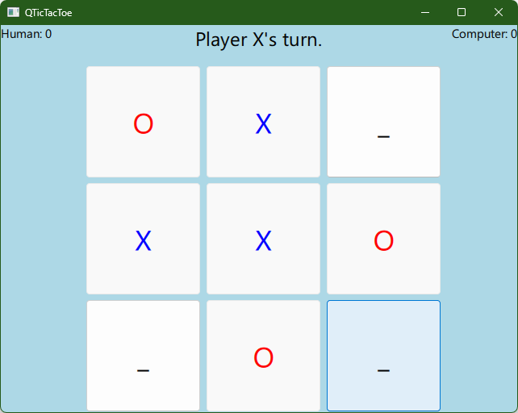

# QTicTacToe
A simple implementation of the famous TicTacToe game using Qt6, QML and C++.

The "AI" of the game uses the minimax algorithm and runs in its own thread in a thread-safe way.

## Building
The project was created using Qt Creator, simply load the project and press CTRL+R.

Alternatively it can be built using CMake.

## Running
The game offers a choice of starting or letting the computer start.
From then on the game goes on until one party wins.

To quit the app, simply close the window.

Can you beat the computer? ;)

## Possible future work
I might add PvP mode, night-mode and persisting points later.

## License
Nothing fancy here, feel free to use this code for any purpose.
